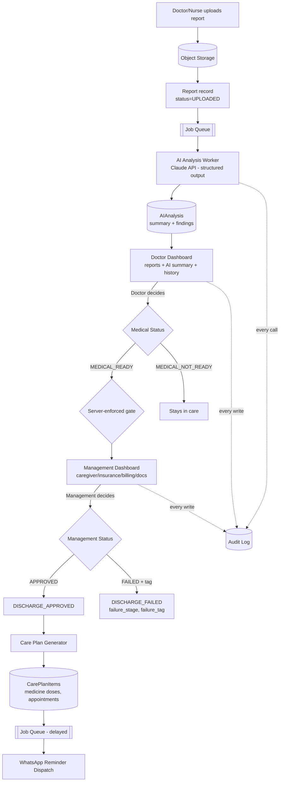

# AI-Assisted Patient Discharge Readiness & Follow-Up Planner
## Architecture, Tech Stack & Implementation Plan

*Domain: Healthcare — Problem Statement 9*

---

## 1. Core Principle

> **AI assists. The doctor decides medically. Management validates operational requirements.**

Every design decision below exists to make this principle **structurally true**, not just a UI convention — the backend, not the interface, is what prevents AI output from ever becoming a discharge decision.

---

## 2. System Architecture

### 2.1 Components

| Component | Responsibility |
|---|---|
| **Doctor Dashboard** | Reports, AI summaries/abnormalities, patient history → submits medical readiness, prescriptions, appointments |
| **Management Dashboard** | Caregiver/insurance/billing/document checklist → submits operational approval or failure + reason |
| **Backend API** | Single service, module-per-bounded-context (Patients, Reports, AIAnalysis, DischargeDecisions, ManagementReviews, CarePlans, Reminders, Audit) |
| **Object Storage** | Raw report files (PDFs, images, notes) — DB holds only metadata + pointer |
| **Job Queue + Workers** | Decouples slow/unreliable work (LLM calls, reminder sends) from the request path |
| **PostgreSQL** | System of record for all structured entities + audit trail |
| **AI/LLM Layer** | Server-side only; summarizes reports and flags abnormalities — never writes a decision |
| **Notification Dispatcher** | WhatsApp-first reminder delivery, pluggable to SMS/email |

### 2.2 End-to-End Data Flow



**Walkthrough:**

1. **Upload** — file → object storage; `Report` row created (`UPLOADED`); job enqueued.
2. **AI analysis (async)** — worker extracts text, calls the LLM with a constrained prompt ("summarize, flag out-of-range values, explain in plain language — do not diagnose, do not recommend discharge") and requests **structured JSON output** (summary, findings[], severity). Stored as `AIAnalysis`, per-report and combined per-encounter. `Report.status → ANALYZED`.
3. **Doctor review** — dashboard shows patient + encounter + reports + AI analysis + full history. Doctor validates/overrides and submits `DischargeDecisionMedical` (READY/NOT_READY, caregiver_required, notes) + `Prescription[]` + `Appointment[]`. Only an authenticated **DOCTOR** actor can write this.
4. **Server-enforced gate** — an encounter only enters the Management queue when `medical_status = MEDICAL_READY`. Enforced by a backend state-machine guard, not merely hidden in the UI.
5. **Management review** — checks caregiver/insurance/billing/documents/other, submits `ManagementReview` (APPROVED / FAILED + `failure_tag`).
6. **Discharge computation** — `Encounter.overall_status` is a derived state machine: `IN_PROGRESS → MEDICAL_REVIEW → MANAGEMENT_REVIEW → DISCHARGE_APPROVED | DISCHARGE_FAILED`, computed in exactly one backend location. `DISCHARGE_APPROVED` fires only when both `MEDICAL_READY` and `APPROVED` are true.
7. **Care plan generation** — on approval, a job expands prescriptions (dose/frequency/duration) and appointments into a dated `CarePlan` with per-dose, per-appointment, per-instruction `CarePlanItem` rows.
8. **Reminders** — each `CarePlanItem` schedules `ReminderLog` rows; a worker (delayed jobs + periodic sweep as a safety net) dispatches via WhatsApp and records delivery status.

### 2.3 Why AI Can Never Decide

- `AIAnalysis` is a pure **input** entity, read-only from the Doctor Dashboard. No code path writes AI output into `DischargeDecisionMedical` or `ManagementReview`.
- Every AI field is UI-labeled "AI-generated — verify." The readiness control is never pre-filled.
- `DischargeDecisionMedical` / `ManagementReview` writes require a human `actor_id` + role check, enforced server-side.
- Every AI call (prompt version, model, input reference, raw output) is logged for auditability and reproducibility.

### 2.4 Audit & History

- `Patient` is the permanent, cross-visit anchor (unique patient ID). `Encounter` is the per-visit unit.
- Nothing is overwritten — a patient's history is simply "all encounters for this patient_id," in order.
- An append-only `AuditLog` (`entity_type`, `entity_id`, `action`, `actor`, before/after state, timestamp) captures every state-changing action system-wide — this both satisfies the PRD's permanent-history requirement and gives a defensible trail for "why did discharge fail."

---

## 3. Tech Stack

| Layer | Choice | Why |
|---|---|---|
| **Frontend** | React + TypeScript + Vite, TanStack Query, Tailwind + shadcn/ui | Fastest path to dashboard-heavy UI (tables, forms, status badges) on a hackathon clock. TanStack Query's polling/caching models "AI analysis is async" (spinner until `AIAnalysis` appears) without hand-rolled state. |
| **Backend API** | Node.js + TypeScript, Fastify | Shared TS types with the frontend cut integration bugs under time pressure. Low-ceremony but supports clean module folders (`modules/reports`, `modules/ai-analysis`, …) mirroring the bounded contexts, so the structure survives a later split into services. Built-in plugins cover file upload, JWT auth, OpenAPI docs. |
| **ORM / DB** | PostgreSQL + Prisma | Entities are inherently relational (Patient→Encounter→Report→AIAnalysis, decisions referencing encounters) and need transactional integrity for computing `DISCHARGE_APPROVED` from two independent reviews. JSONB absorbs AI findings without a second datastore; `pgvector` can add history-similarity search later with zero new infra. |
| **File/Object Storage** | S3-compatible (AWS S3 / Cloudflare R2 in prod, MinIO locally) | Keeps large binaries out of Postgres; DB stores only the object key + metadata. |
| **AI/LLM** | Claude API, called only from a backend worker, structured/tool-use output | Server-side-only keeps the key off the client and creates one choke point for de-identification and audit logging. Structured JSON output avoids fragile parsing. System prompt explicitly restricts the model to summarization/flagging — never diagnosis or discharge recommendations. |
| **Background Jobs** | Redis + BullMQ | Well-documented Node queue; trivial in Docker locally or a managed free-tier Redis for the demo. Delayed jobs map directly to "send this reminder at this future timestamp." Scales to multiple worker replicas with no code change. |
| **Auth & RBAC** | JWT with a `role` claim (DOCTOR / MANAGEMENT / ADMIN); hosted auth (Clerk/Supabase Auth) to skip building login flows | Centralizes the "only a human actor can decide" rule in one middleware check. Swaps for hospital SSO/SAML later without touching business logic. |
| **Reminders** | Twilio WhatsApp (sandbox for demo, Business API for production) | Abstracts WhatsApp session/template complexity; sandbox mode works instantly without lengthy business verification. Same pattern extends to SMS/email fallback. |
| **Deployment** | Docker Compose locally; Vercel/Netlify (frontend) + Railway/Render/Fly.io (backend, managed Postgres+Redis) for the demo | Near-zero DevOps, git-push deploys, public URL for judges. Scale path: same containers → AWS ECS/Fargate + ALB, RDS Multi-AZ, ElastiCache, S3 — AI-analysis and reminder workers become independently autoscaled first, since they're the load-variable pieces. |

---

## 4. Data Model

| Entity | Key Fields | Relationships |
|---|---|---|
| **Patient** | id (permanent unique ID), mrn, name, dob, gender, contact_phone | 1—N Encounter |
| **Encounter** | id, patient_id, admission_date, discharge_date, ward, overall_status, failure_stage, failure_tag | 1—N Report, Prescription, Appointment; 1—1 DischargeDecisionMedical, ManagementReview, CarePlan |
| **Report** | id, encounter_id, type (BLOOD/DIAGNOSTIC/CLINICAL_NOTE/MEDICATION/OTHER), file_object_key, status | 0..1—1 AIAnalysis |
| **AIAnalysis** | id, report_id (nullable if overall), encounter_id, scope (PER_REPORT/OVERALL), summary_text, abnormal_findings (JSONB), plain_language_explanation, model_used, prompt_version, raw_response | Read-only input to Doctor Dashboard |
| **DischargeDecisionMedical** | id, encounter_id, doctor_id, medical_status (MEDICAL_READY/MEDICAL_NOT_READY), caregiver_required, doctor_notes, decided_at | 1—1 Encounter |
| **Prescription** | id, encounter_id, medicine_name, dosage, frequency, route, duration_days, start_date, instructions | N per Encounter |
| **Appointment** | id, encounter_id, type/department, scheduled_date, provider/location, instructions | N per Encounter |
| **ManagementReview** | id, encounter_id, management_user_id, caregiver_available, insurance_status, billing_status, documents_status, other_notes, management_status (PENDING/APPROVED/FAILED), failure_tag | 1—1 Encounter |
| **CarePlan / CarePlanItem** | CarePlan: id, encounter_id, discharge_date. Item: item_type (MEDICINE_DOSE/APPOINTMENT/INSTRUCTION), source_ref, scheduled_at, description, status | CarePlan 1—N CarePlanItem 1—N ReminderLog |
| **ReminderLog** | id, care_plan_item_id, channel (WHATSAPP/SMS/EMAIL), scheduled_at, sent_at, status, provider_message_id, retry_count | N per CarePlanItem |
| **AuditLog** | id, entity_type, entity_id, action, actor_user_id, actor_role, before_state, after_state, timestamp | Append-only, polymorphic across all entities |
| **User** | id, name, role (DOCTOR/MANAGEMENT/ADMIN), email/phone, auth_id | Referenced by all decision entities |

### Discharge status values (from PRD §4–5)

```
Medical Status:      MEDICAL_READY | MEDICAL_NOT_READY
Management Status:   PENDING | APPROVED | FAILED
Failure Tags:        CAREGIVER_UNAVAILABLE | INSURANCE_PENDING | BILLING_PENDING
                      | DOCUMENTS_INCOMPLETE | OTHER_ADMINISTRATIVE_ISSUE
Overall:              DISCHARGE_APPROVED  (requires MEDICAL_READY AND APPROVED)
                      DISCHARGE_FAILED    (with failure_stage + failure_tag)
```

---

## 5. Phased Implementation Plan

### Phase 0 — Setup (hours, not days)
Repo scaffold, Docker Compose (Postgres/Redis/MinIO), Prisma schema for core entities, auth skeleton.

### Phase 1 — Core MVP *(the demoable deliverable — prioritize this over everything else)*
- Patient/Encounter CRUD with unique patient ID
- Report upload → object storage + `Report` record
- AI analysis pipeline (per-report + combined overall summary) → `AIAnalysis`
- **Doctor Dashboard**: reports + AI summary/abnormalities + history → submit medical decision + prescriptions + appointments
- **Management Dashboard**: checklist → submit APPROVED/FAILED + tag, view failure reason
- `Encounter.overall_status` state machine wired end-to-end; auto-generate `CarePlan` on approval
- Basic RBAC (Doctor vs Management), `AuditLog` on every decision

This alone is a complete, demoable vertical slice of the entire PRD workflow.

### Phase 2 — Enhancements *(if time remains)*
- Cross-encounter patient history view
- WhatsApp reminders (Twilio sandbox + BullMQ delayed jobs + cron sweep)
- Doctor edit/override of AI summary (makes human-in-the-loop visible to judges)
- Admin role + audit trail viewer
- Async UI polish (loading states while AI processes)

### Phase 3 — Stretch
- OCR for scanned reports
- PII de-identification pass before LLM calls
- Patient-facing read-only care-plan view (magic link)
- pgvector-based "similar past findings" search
- Multi-tenant/SSO story, prompt versioning + eval harness
- Production WhatsApp Business API + SMS/email fallback

---

## 6. Risks & Guardrails

**Privacy / PHI**
Use synthetic/de-identified data for the demo — never real patient data. Before any LLM call, strip direct identifiers (name, DOB, contact, MRN) from report text, replacing with a pseudonymous token, and reattach identity only after the response is stored server-side. Encrypt at rest and in transit. RBAC enforces minimum-necessary access (e.g., Management sees checklist status, not raw clinical text). Document BAAs with third-party AI/SMS vendors and a retention/deletion policy as known MVP gaps.

**Safety / Human Oversight**
No code path lets AI output set `MEDICAL_READY` or approve discharge — only authenticated DOCTOR/MANAGEMENT actors can write those records, enforced server-side. AI fields are always labeled "AI-generated — verify" and never pre-fill the readiness control. AI language stays in "possible abnormality" / plain-language territory, avoiding diagnostic claims, to stay clear of regulated-medical-device framing. The full audit trail makes every decision traceable — a governance win and a strong judging point.

**Scalability path to a real product**
Add `hospital_id` for multi-tenancy. Run AI analysis and reminder dispatch on independently scalable worker pools so LLM latency/cost never affects core API responsiveness; consider a cheaper first-pass model with escalation only when abnormalities are flagged. Postgres scaling path: read replicas for dashboards/history, time-based partitioning for `AuditLog`/`ReminderLog`. The `Report`/`Encounter`/`Prescription` model is intentionally close to FHIR's `DocumentReference`/`Encounter`/`MedicationRequest` resources, so an HL7 FHIR adapter is feasible without a data-model rewrite. Real deployment needs a HIPAA compliance program and must keep AI strictly assistive to avoid FDA/regulatory classification as a diagnostic device — consistent with the PRD's core principle.

---

## 7. First Files to Create (when implementation starts)

- `prisma/schema.prisma` — defines all entities/relationships in §4
- `apps/backend/src/modules/ai-analysis/ai-analysis.service.ts` — the assistive-AI boundary: prompt constraints, structured output, de-identification hook
- `apps/backend/src/modules/discharge/discharge-state-machine.ts` — enforces `MEDICAL_READY AND APPROVED → DISCHARGE_APPROVED` and the human-actor-only write guard (the core safety rule)
- `apps/backend/src/modules/care-plan/care-plan-generator.ts` — expands prescriptions/appointments into dated `CarePlanItem`s
- `apps/backend/src/modules/audit/audit.service.ts` — single write path for `AuditLog`, called from every other module
